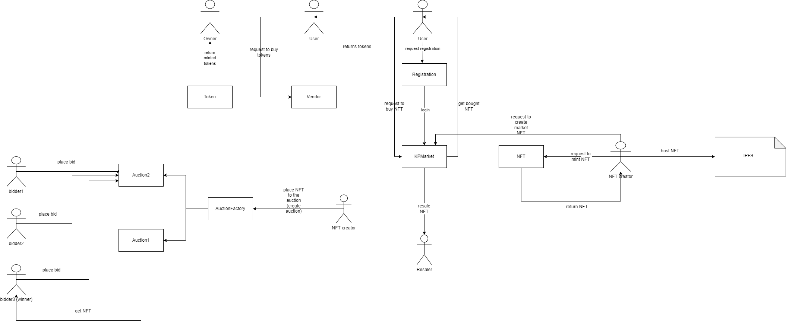
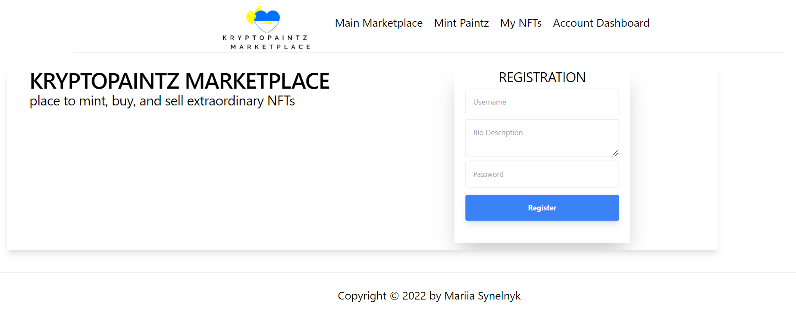

# NFT Mapketplace DApp

|  Title        | Marketplace for NFTs on Polygon |       
| ------------- | --------------------------------|
| Description   |Minting NFTs (ERC721) as a creator, sell them and get royalties from resale. As currecncy is used own market token `MARIPAINTZ` or ETH                               |
| Solidity Version  | ^0.8.9                      |
| License           | MIT         |
| Author | Mariia Synelnyk

---

## Main Description 

NFT Marketplace (for minting, buying and selling NFTs live with IPFS data hosting) onto Polygon as a layer2.  

---

## TODO
&#9744; implement Airdrop for every week promotion for paricipants with Chainlink

&#9744; implement secondary royalties 

&#9744; implement ability to create collections

&#9744; implement likes|dislikes for tokens|collections

&#9744; save more info about NFTs

&#9744; fix registration and login

&#9744; add frontend

---

## Developer tools
- Solidity - an object-oriented, high-level language for implementing smart contracts
- OpenZeppelin - a library for secure smart contract development
- Hardhat - a development environment to compile, deploy, test, and debug the process of building smart contracts and dApps (can also use Waffle)
- Web3.js - a collection of libraries that allow you to interact with a local or remote ethereum node using HTTP, IPC or WebSocket (can also use ethers.js)
- Chai and Mocha - the most advanced framework for testing smart contracts (can also use Waffle)
- Polygon - solves common blockchain pain points, offering low gas fees and high speeds without sacrificing security. For local tests is using  Polygon Mumbai
- Infura - runs ethereum nodes and provides access to them via api to eliminate the need to run and update your own infrastructure
-IPFS - a peer-to-peer hypermedia protocol
designed to preserve and grow humanity's knowledge
by making the web upgradeable, resilient, and more open
- React - is an open-source JavaScript framework, designed for building apps on multiple platforms like iOS, Android, and also web applications, utilizing the very same code base. It is based on React, and it brings all its glory to mobile app development.
- Tailwind - a utility-first CSS framework packed with classes like flex, pt-4, text-center and rotate-90 that can be composed to build any design, directly in your markup

----

## High level diagram



## Use cases & Usage Scenarios

### Token

### NFT

### Vendor

### UserRegistration

#### Usage Scenarios 
#### Governance can

### KPMarket

#### Usage Scenarios 
#### Governance can

### Auction

#### Usage Scenarios 
#### Governance can

### AuctionFactory

#### Usage Scenarios 
#### Governance can

---

## Events

---

## Sequence diagrams

---

## Third party library
The smart contracts inherit next SC from the openzeppelin libraries:

```Ownable.sol``` - access control

```ReentrancyGuard.sol``` - reentrancy guard pattern

```SafeMath.sol``` - to prevent ower/under flows

```Address.sol``` - to work with address types

```Counters.sol``` - 

--- 

## Running 
To run project you shold install this
```shell
https://hardhat.org/getting-started/
```

To run tests
```shell
npx hardhat test
```

To deploy to local network
```shell
npx hardhat node
npx hardhat run scripts/deploy.js --network localhost
```

To run on localhost
```shell
npm run start
```
or 
```shell
npm run build
npm run start
```

Price

1 ETH = 50 MARIIA COIN

The price in `MRSNLK` for the NFT will be calculated automatically. If the price in ETH in 0.0001 eth, the price in `MRSNLK` will be 0.005 MRSNLK.


# UI Interface


